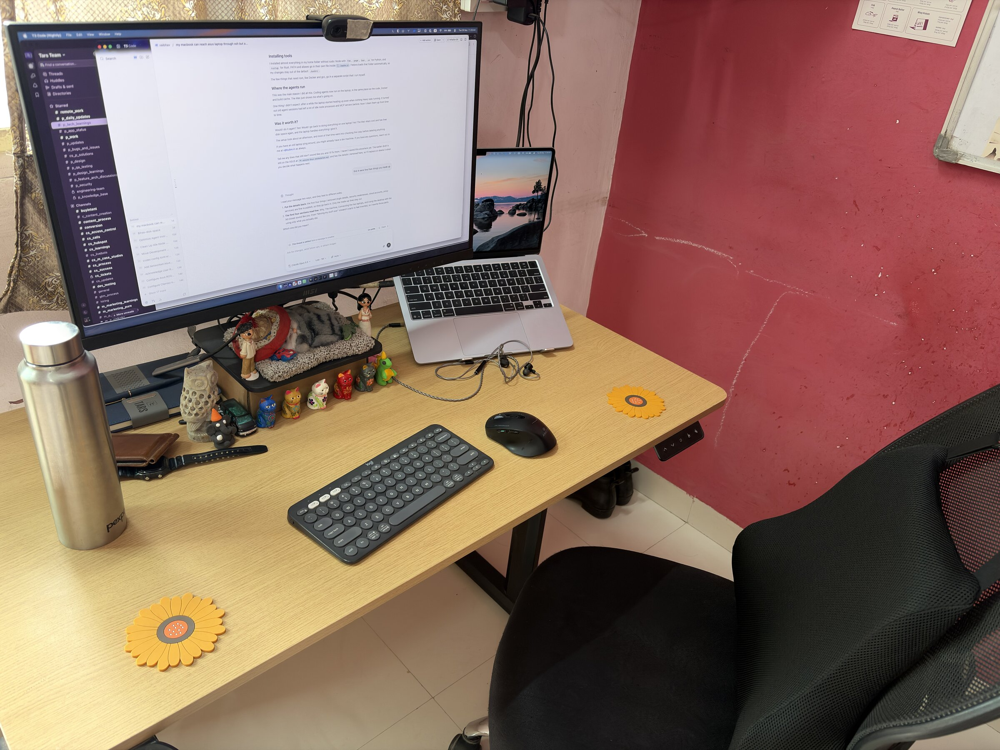
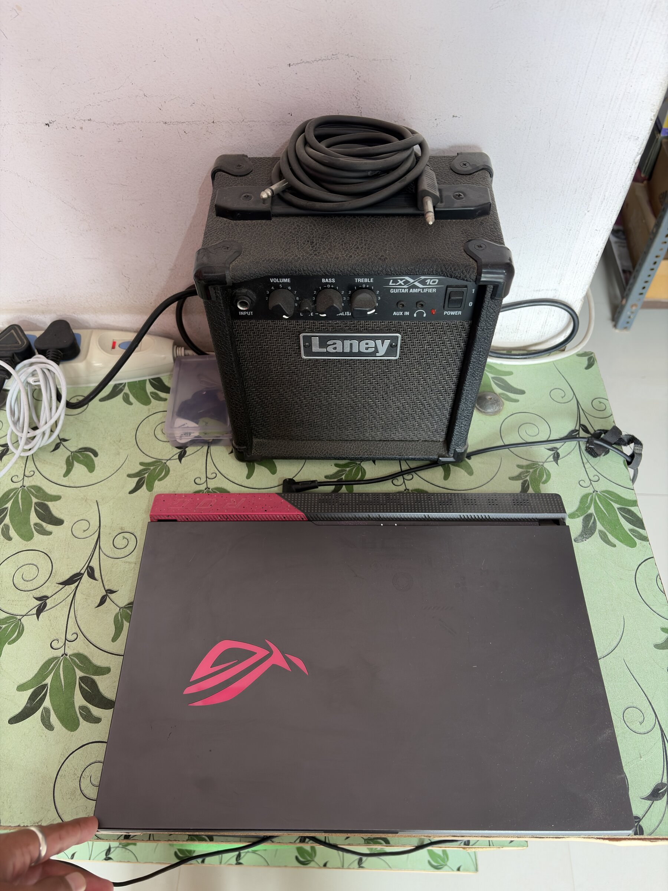

# Why

My MacBook Air was doing everything. Docker, builds, and a few coding agents running at the same time. It was always hot, and I kept running out of disk space. At the same time I had an ASUS laptop that I barely used. It has 16 threads, 16 GB of RAM and a 1 TB disk, which is more than enough for what I do.

So I thought, why not let the ASUS do the work and use the Mac only to connect to it?

_That's it!_ That's the entire idea. The rest of this post is how I set it up and what I learned.

# The machine

The ASUS runs Fedora with KDE Plasma. Its lid stays closed and it stays on all the time. I kept the full desktop instead of a server install, because sometimes an app needs you to click something in a GUI, and I didn't want to open the lid every time that happens.

# Connecting the two laptops

I use Tailscale for this. It puts all your devices on a private network, and each one gets a name you can use from anywhere. So I don't need to forward ports or change anything on my router, and it works the same at home or outside.

After that, SSH is just a normal SSH config entry on the Mac with its own key, and I also set it up the other way, so the ASUS can SSH back to the Mac when it needs something.

One thing that confused me for a while: the Tailscale app on the Mac can be open while Tailscale itself is stopped. When that happens nothing connects and it looks like the other machine is down. If that happens to you, run `tailscale status` before anything else.

# Using the desktop with the lid closed

KDE has a built-in RDP server, so I didn't need to install anything extra. I made it listen only on the Tailscale network, and I connect from the Mac with Microsoft's Windows App.

The first time I connected I only got a black screen. The connection was working fine. The problem was the laptop had locked itself and turned off its display because the lid was closed, so there was nothing to show. Once the display stayed on, it worked.

# Moving my stuff over

I copied my projects and config from the Mac using rsync, and skipped `node_modules` and build folders. That took it from about 31 GB to 9 GB.

Before deleting anything from the Mac, I ran rsync in dry-run mode for each folder to make sure everything was copied, and moved things to the Trash instead of deleting them right away.

# Installing tools

I installed almost everything in my home folder without sudo: Node with `fnm`, `pnpm`, `bun`, `uv` for Python, and `rustup` for Rust. PATH and aliases go in their own file inside `~/.bashrc.d/`, which Fedora loads automatically.

The few things that need root, like Docker and gcc, go in a separate script that I run myself.

# Where the agents run

Coding agents now run on the laptop, in the same place as the code. The Mac just shows me what's going on.

# Was it worth it?

Would I do it again? Yes! Would I go back to doing everything on one laptop? No!

If you have any questions, reach out to me at v@kubre.in as always.
