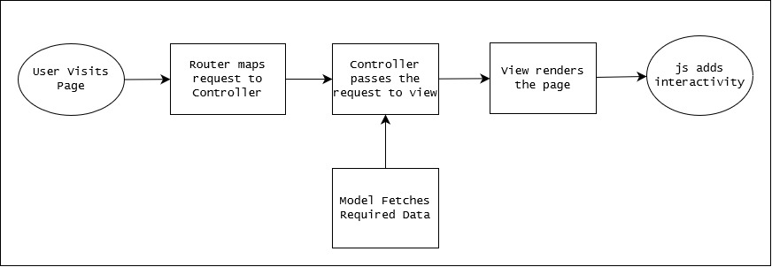
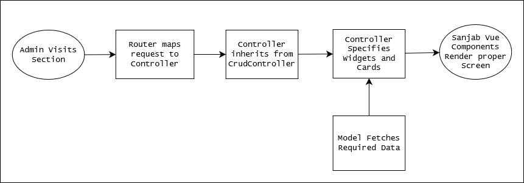
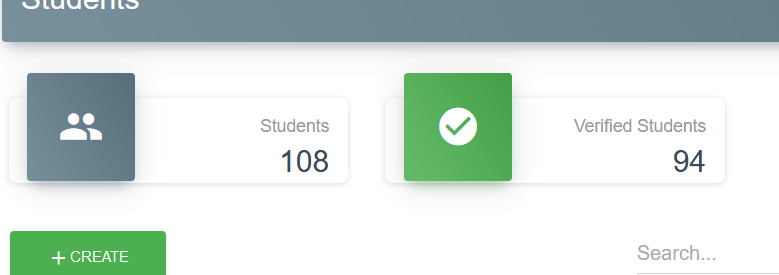
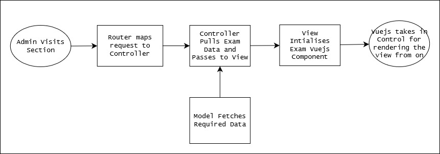

<blockquote>
This is not a full-blown Technical Document, but rather in my own words a small overview of what went behind in making the GateArch website. If you have a question or want to know more, reach out to me at v@kubre.in as always.
</blockquote>

# Overview

GateArch is a platform where students can register to study better in preparation for architecture-related exams. People who run the website handcraft posts, and tests to provide these to students to help them before they actually go for a real exam. This means the environment must be as similar as possible to get them familiar with this process.

| Software Stack        |                                   |
| --------------------- | --------------------------------- |
| Frontend              | Bootstrap, Vuejs, ChartJS, jQuery |
| Serverside            | Laravel                           |
| Database              | MySQL                             |
| Versioning/Management | Git and GitHub                    |
| Package Management    | Composer                          |
| Server                | Nginx                             |

| Hardware Stack |                |
| -------------- | -------------- |
| CPU            | 1 vCPU         |
| RAM            | 1 GB DDR4      |
| Storage        | 40 GB NVME SSD |
| OS             | Ubuntu 18.04   |

<blockquote>
The entire GateArch website was previously hosted on a shared hosting account which was already provided by GateArch(Cognimize LLC) themselves, but later the shared host provider removed SSH access and I helped them to shift this all over to a VPS server.
</blockquote>

# Why this stack?

Before I start describing the application and process, Here is the reason why all the above choices in the stack were made.

-   _Laravel:_ This was one of the first large projects I was working on. This means I would have to take care of a lot of things. This includes everything from Auth and Security to DB Management. At this point, I’ve been Laravel for a while and used it in smaller projects also. It comes with so great things to help you focus on building the actual application rather than the boilerplate.
-   _Bootstrap:_ Even in 2019 this seems like an odd choice but I’ve been using Bootstrap since the V3 beta and I was familiar with it a lot. It helped me quickly architect the frontend. In my opinion, if you’re a person who cares for speed of development and mature-looking design set over fine grain control over design, Bootstrap is one of the best choices. In 2023 I moved to Tailwind and even if given a choice today I would have preferred Tailwind. As
-   _jQuery:_ jQuery provides a clear and concise syntax on top of javascript to manipulate dom or do small interactions without needing to write the whole page in a SPA-like manner. Server-rendered pages have good speed and SEO whereas jQuery helps to add that little bits of interactivity to make it feel snappier.
-   _Vuejs:_ Dashboard(Admin, Student) and Exam Portal use Vuejs as it’s easier to maintain them in a SPA-like manner. Complex states and logic can be managed without DOM manipulating too much. Dashboard also doesn't need SEO so server rendering does not provide any benefits here. Also, heavy client interactions like in the Exam Portal are easy with frameworks like Vuejs
-   _MariaDB/MySQL:_ Considering entire application needs can be entirely modeled using Relational Model. MySQL is just simply a widely available and mature choice. Even in 2023 goto choice for DB is always MySQL unless I need to do something that is hugely niche like storing vector embeddings, etc.
-   _Git:_ Every programmer from the beginning MUST use version control and preferably git. I can not count how many times it helped to quickly implement a feature on one branch and discard it if I did not like it. I also upgraded the whole Laravel version on one branch with Gaterach without affecting the Prod branch and once it was all done merged it back to prod everything without breaking a sweat.
-   As for server hardware, I’m simply being pragmatic. GateArch is an emerging startup and should focus on bringing on the users and not thinking about complex architecture around scaling unless it needs it etc. A simple VPS server alongside Nginx is what keeps costs low until they need to scale up. This should be enough for thousands of users. Once they actually grow to size then they can move to the environment like AWS.

# Architectural Strategy

The entire Application was divided into 4 parts as follows

| Section        | Function                                                                                                                                                              | What was used                                                                   |
| -------------- | --------------------------------------------------------------------------------------------------------------------------------------------------------------------- | ------------------------------------------------------------------------------- |
| The Front Page | Landing Page anyone can see went they visit the website, this also houses the blog section which can be updated by the admin of the website                           | Laravel Server Rendered and bits of javascript for interactivity                |
| Admin Panel    | The admin panel is used by Website administrators and Teachers to manage the website and manage exams etc                                                             | Sanjab Component Package for defining the dashboard                             |
| Student Portal | The student portal is where students can log in, read articles, purchase exams, and view exams and their results alongside ranking among the students                 | Bootstrap, and Laravel to render pages and javascript for bits of interactivity |
| Exam Portal    | Although it looks like it's part of the student portal, it's entirely its own Vuejs application to manage complex states during exams, a SPA-like behavior was needed | Laravel to initial render and hydrating Vuejs App                               |


_The Front Page_



-   Most of the pages are static and do not need any further data.
-   Some of them which need data like blog pages will be fetched from DB to be server rendered.
-   Any interactive parts like Slider are using javascript and js libraries.

_Admin Panel_



-   The initial flow is similar to the front website, but the difference comes in when Request approaches the Controller.
-   Admin Panel uses https://github.com/sanjabteam/sanjab laravel package to specify admin dashboard screens.
-   The controller has to inherit from `CrudController` class which lets the Sanjab package know it is primarily a data-oriented screen and will need to have CRUD Forms alongside Datatable to perform bulk operations.
-   `CrudController` requires to have a Model Class attached to it to be manipulated. Properties of that model then can be used in widgets like the following, Here `start_at` attribute from Model is used for a DateTime WIdget
    ```php
    $this->widgets[] = DateTimeWidget::create('start_at', 'Start Date')
    ```
-   Sanjab takes care of rendering Vuejs-based Widgets that have the material design.
-   Statistics alongside the data table can render using a cards array instead of widgets and Card Child Component Classes.



_Student Portal_

-   Students can register to the website using Auth Screen they also need to verify using OTP which uses a Third Party service to send and verify the Mobile numbers.
-   Student Portal also follows the same architecture as the front pages with Auth and verified OTP middlewares in between to make sure unauthenticated users don't access it.
-   Students can view the results of the exams which are rendered using the ChartJS library to provide visualizations on top of just the numerical data.
-   They can also Purchase exams that use the [PayU](https://www.payumoney.com/) payment service to accept payments.

_Exam Portal_



-   Exam Portal is a full SPA-like App that only uses Laravel to initially hydrate and then end the Exam.
    -   The server Renders the `exam.main` view alongside passed-in data as JSON on the application's state.
    -   Vue uses this JSON to construct the entire examination screen, if you wondering how here it is `this.exam = {!! json_encode($exam->toArray(), JSON_HEX_TAG) !!}`. It is easy and simple and saves an entire network API call for data that could be pre-filled from the server.
-   Unlike Admin Dashboard this was written from scratch by me as it was my first time using Vuejs and I also wanted to have a learning experience with it.
-   The entire screen was modeled after how actual Architecture exams take place from the same question, and section structures to the calculator, all the behavior was modeled to let users have a sort of virtual experience of final exams.

# Deployment & Maintenance

-   GateArch was first deployed to a Shared Hosting site because it was previously purchased, but sooner we ran into deployment issues using SSH, and then I migrated the entire project to a VPS server as stated above in the hardware stack.
-   The entire project is version controlled by using git.
-   The server used a Ubuntu 18.04 LTS image as the base for the VPS
    -   Then using the package manager I installed PHP 7.4 and other PHP plugins required for Laravel.
    -   Installed MySQL db and set it up to be only accessed from inside the VPS server by the application and not over the internet, using a newly created user.
    -   The last was to set up nginx via nginx config files and SSL certificates with the help of python-certbot.
    -   Nginx serves the application from code in a directory on the www/ folder, with the help of a `git post-receive` hook I can push my PROD branch from local to the VPS server which then would take care of copying code to nginx to clear cache, etc.
    -   Here is an example of such post-receive hook scripts look like
        ```php
        #!/bin/bash
        unset GIT_INDEX_FILE
        git --work-tree=/var/www/application.com --git-dir=/home/server/app.git checkout -f
        cp ~/.env /var/www/application.com/.env
        cd /var/www/application.com
        composer install --no-dev
        composer dumpautoload -o
        php artisan migrate
        php artisan view:cache
        php artisan route:cache
        php artisan config:clear
        ```
-   Not only this but using a simple cron job and simple bash I made weekly backups which were downloaded back to my local system in I ever need to restore it, in case of losing it attack or something.

> While creating this entire project Congnimize LLC and I was in a constant feedback loop. And I always helped them to flush ideas into the website they wanted.


<a href="https://github.com/kubre/GateArch" target="_blank" rel="noopener noreferrer">Github Source Code</a>
