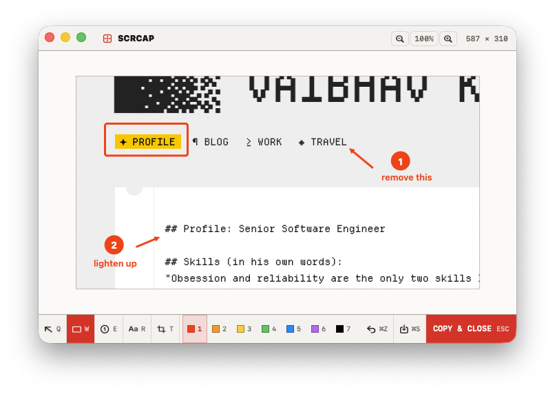

<blockquote>
scrcap is a native macOS screenshot tool built around speed: hit a shortcut, capture what you need, mark it up, and get the PNG where it needs to go.
</blockquote>

    <a href="https://github.com/kubre/scrcap/releases/latest" target="_blank" rel="noopener noreferrer">
        Download the latest release
    </a>

# Overview

scrcap is a small macOS app for screenshots, annotations, and quick exports. It is written in Swift and AppKit, uses ScreenCaptureKit for capture, and keeps the core model separate from the macOS UI so the capture and editor logic stays easy to test.

The app is built for the common screenshot flow: capture a region, window, full screen, or scrolling area; make quick annotations; then copy, save, or drag the finished image into another app.

| Platform  | macOS 14+                                       |
| --------- | ----------------------------------------------- |
| App stack | Swift, AppKit, ScreenCaptureKit                 |
| Core      | Portable Swift module with no AppKit dependency |
| Downloads | GitHub Releases                                 |

# Features

- Region capture with crosshair coordinates, mid-drag move, and Esc to abort.
- Window capture with hover highlight and cycling for overlapping windows.
- Fullscreen capture for the display under the cursor.
- Scrolling capture that selects a region, scrolls, and stitches the result.
- Repeat-last capture for quickly grabbing the same region, window, or screen again.
- Remappable global hotkeys in Preferences.
- Editor tools for arrows, rectangles, counters, text, crop, undo, redo, and color shortcuts.
- Copy, save as PNG, or Option-drag the flattened image into another app.

# Editor

The editor is deliberately direct. The current tool stays armed, so drawing another arrow or rectangle does not require switching back from a selection mode. If a mark is wrong, use undo and draw again.

| Key               | Action                                    |
| ----------------- | ----------------------------------------- |
| Q / W / E / R / T | arrow / rectangle / counter / text / crop |
| 1-7               | color shortcuts                           |
| Esc               | copy to clipboard and close               |
| Command-C         | copy and keep the editor open             |
| Command-S         | save as PNG                               |
| Command-W         | discard and close                         |
| Option-drag       | drag the flattened PNG out                |

# Performance

scrcap is a native app with no Electron shell and no runtime framework bundle. The release build is stripped and optimized for size, and the build script checks that release artifacts stay under a small size budget.

The current app bundle is under 1 MB locally, and the release gate is set to keep app artifacts below 5 MB.

# Install

Download `scrcap-macos.dmg` from the latest GitHub Release:

    <a href="https://github.com/kubre/scrcap/releases/latest" target="_blank" rel="noopener noreferrer">
        github.com/kubre/scrcap/releases/latest
    </a>

Open the DMG, drag `scrcap.app` to Applications, then launch it. The first capture asks for Screen Recording permission. Scrolling capture asks for Accessibility permission only when you use that mode.

<blockquote>
scrcap is not notarized by Apple yet, so macOS may ask you to approve it from System Settings -> Privacy & Security the first time you open it.
</blockquote>
