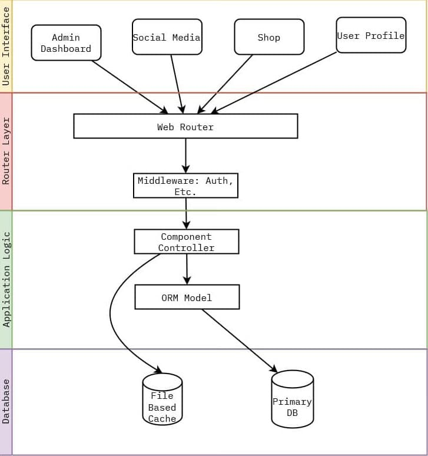

<a class="underline" href="https://github.com/kubre/TaxGlobe" target="_blank" rel="noopener noreferrer">Github Source Code</a>

<aside class="note">
💡 This is not a full-blown Technical Document, but rather in my own words a small overview of what went behind in making TaxGlobe's website. If you have a question or want to know more, reach out to me at v@kubre.in as always.
</aside>

## 🗨️ Overview

TaxGlobe is a website designed for Chartered Accountants (CAs) and CA students. This website allows users to share their thoughts, follow each other, and purchase software or books. This document details how the entire website was built from scratch using Laravel.

| Software Stack        |                                 |
| --------------------- | ------------------------------- |
| Frontend              | Livewire, TailwindCSS, AlpineJS |
| Serverside            | Laravel                         |
| Database              | MariaDB                         |
| Versioning/Management | Git and GitHub                  |
| Package Management    | Composer                        |
| Server                | Nginx                           |

| Hardware Stack |                |
| -------------- | -------------- |
| CPU            | 1 vCPU         |
| RAM            | 1 GB DDR4      |
| Storage        | 40 GB NVME SSD |
| OS             | Ubuntu 20.04   |

<aside class="note">
💡 Since it is a monolithic application, the entire website can be hosted on a single VPS, which works well for hundreds of users.
</aside>

## 🛡️ Why this stack?

Before I start describing the application and process, Here is the reason why all the above choices in the stack were made.

<div class="spaced-list">

-   **Laravel:** Laravel is one of the most mature, and detailed web frameworks out there, This includes all programming languages and not just PHP. It has one of the best documentation, strong conventions and patterns, and the ease of PHP built into it. Hosting it is also a trivial process I’ve hosted several smaller Laravel applications on Shared Hosting platforms and it works great. Also at this point, I’ve been using Laravel for 2+ years at least.
-   **Livewire:** Though a new package but it was something that helped reduce boilerplate javascript I had to write to do simple AJAX actions. Which usually involves updating part of the page.
-   **TailwindCSS:** Tailwind helps in quickly scaffolding custom styles without having to break a sweat. Something like Bootstrap always felt too constructed to me, whereas with Tailwind I could write CSS with speed. Tailwind is something I still use to this date. [kubre.in](https://kubre.in) actually uses tailwind to do the styling.
-   **MariaDB/MySQL**: Considering entire application needs can be entirely modeled using Relational Model. MySQL is just simply a widely available and mature choice. Even in 2023 goto choice for DB is always MySQL unless I need to do something that is hugely niche like storing vector embeddings, etc.
-   I would not explain why I used git, It's something every programmer should know and actively use.
-   As for server hardware, I’m simply being pragmatic. Taxglobe is not Netflix it does not need complex build systems and Lamdba deployments. A simple VPS server alongside Nginx is what keeps costs low until they need to scale up. This should be enough for thousands of users reading posts.

</div>

## 📝 Goals and Guidelines

Before even any part of the code started I flushed out all the requirements over long calls during which I not only gave examples of how features could be implemented but actively helped Taxglobe to convey their full requirements to me. During this, I noted down all the details, and I made a proper draft of all the requirements You can take a look at the bottom of `Readme.md` on GitHub.

1. **Social Media:** tax globe wanted a Social media experience similar to LinkedIn where you can create, share posts, and write microblogs too. You should also be able to connect to different people.
2. **Shop:** TaxGLobe sells many books and software. The shop section would host these physical and virtual products. Users can purchase them and pay for them online, download/print invoices, etc.
3. **Admin Panel:** This will help Taxglobe to manage and monitor the entire website activity. This includes users registering to the website, moderating posts, adding products to the shop, updating shop orders, analytics, and more.

## 🛠️ Architectural Strategy



Most of the application follows the above architecture.

<div class="spaced-list">

1. When a person visits the website, index.php loads the Laravel application which in turn loads the Application Router (This is handled by Laravel itself so I won't go into detail here)
2. For every route, there is a Component Controller Class that handles it. Router’s job is to hand over the Request to this Component Controller.
    1. You can also specify middleware that intercepts these flows, common middleware in this application was the `auth` middleware as the name suggests it checks whether or not the user is authenticated if not then redirects them back to the login screen
    2. Any number of middleware could be chained and for taxglobe I used a few of these throughout the application to intercept between some routes
3. Controller Receives `Request` object alongside anything the URL path might consist like id, slug, etc. as a parameter.

    1. Dependency Injection provided by laravel is heavily used in this as in the controller if you specify the type of data you want to receive Laravel would construct that object and pass it to the Controller. In the following example you can see I only specified route would have a path param named `post` and Laravel’s Dependency Injection automatically fetches the correct post by id from the database and passes it to Component because of the type hint provided.

        ```php
        # Router
        Route::get('posts/{post}', SocialMedia\PostComponent::class)

        # Controller
        public function (Request $request, Post $post) { }
        ```

4. The component holds the actual logic. Most of the time I needed to get some extra data from the database and transform it or just needed to render a view.
    1. Getting data or Updating data was easily handled using Models, Models a representation of data in the database as an Object form.
    2. Rather than writing frisky SQL queries Eloquent ORM was used in defining these models, alongside any relations they have to easily work with the database.
    3. To have authorization on data [Laravel Guards](https://laravel.com/docs/8.x/authorization#gates) are used.
    4. For more complex authorization needs Models can have [Policies](https://laravel.com/docs/8.x/authorization#creating-policies) attached to them. Where middleware helps in authenticating the user, Model Policies help authorize users for action on the model, Ex User might be logged in (which is authentication) but they cannot edit someone else’s post (This is authorization).
5. At last, the Application renders the view, which where mostly written using [Laravel’s Component](https://laravel.com/docs/8.x/blade#components), or Livewire components.
    1. Laravel ia s server rendered framework which means a full page refresh is needed to act, this might not be desirable in a situation like liking the post in the n social media section. Here comes Livewire which bridges the gap and can directly call PHP code from the front end.
    2. Obviously, this is still using javascript inside of it, but that is the javascript(one less language) I do not have to write and maintain.
    3. This provides not only the benefit of having extremely fast server-rendered pages using Blade but all of them rich UI actions using Livewire to do action usually achieved using AJAX and javascript.

</div>

<p>
You can clearly see how I architected the entire application using tried and tested MVC patterns. This helped to organize the code way better than doing it from scratch.
</p>

## 🚚 Deployment & Maintenance

-   The project was deployed to a VPS server as stated above in the hardware stack.
-   The entire project is version controlled by using git.
-   The server used a Ubuntu 20.04 LTS image as the base for the VPS
    -   Then using the package manager I installed PHP 7.4 and other PHP plugins required for Laravel.
    -   Installed MySQL db and set it up to be only accessed from inside the VPS server by the application and not over the internet, using a newly created user.
    -   The last was to set up nginx via nginx config files and SSL certificates with the help of python-certbot.
    -   Nginx serves the application from code in a directory on the www/ folder, with the help of a `git post-receive` hook I can push my PROD branch from local to the VPS server which then would take care of copying code to nginx to clear cache, etc.
    -   Here is an example of such post-receive hook scripts look like
        ```php
        #!/bin/bash
        unset GIT_INDEX_FILE
        git --work-tree=/var/www/application.com --git-dir=/home/server/app.git checkout -f
        cp ~/.env /var/www/application.com/.env
        cd /var/www/application.com
        composer install --no-dev
        composer dumpautoload -o
        php artisan migrate
        php artisan view:cache
        php artisan route:cache
        php artisan config:clear
        ```
-   Not only this but using a simple cron job and simple bash I made weekly backups which were downloaded back to my local system in I ever need to restore it, in case of losing it attack or something.

> During the entire process, I maintained constant contact with the TaxGlobe team to receive feedback on the progress. The project was completed down to the smallest details and received 100% positive feedback.
