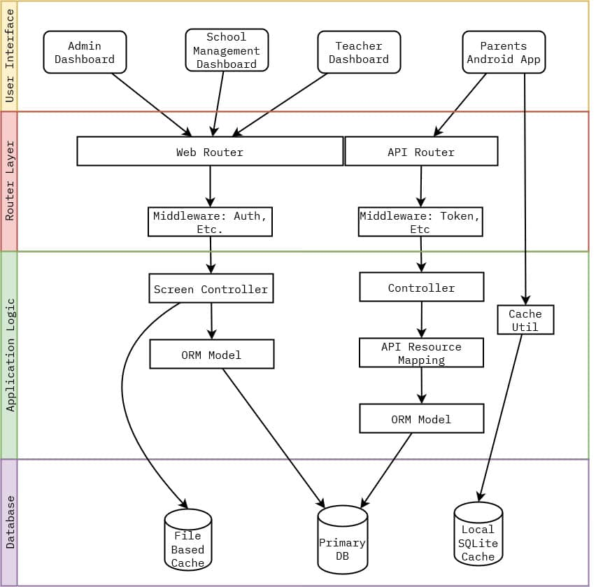

<a class="underline" href="https://github.com/kubre/WonderLearning" target="_blank" rel="noopener noreferrer">Github Source Code</a>

<aside class="note">
💡 This is not a full-blown Technical Document, but rather in my own words a small overview of what went behind in making the Wonder Learning LMS website. If you have a question or want to know more, reach out to me at v@kubre.in as always.
</aside>

## 🗨️ Overview

Wonder Learning provides services to schools. This was their Learning Management Platform where to onboard schools will have a completely digital workflow. School management can deal with inquiries, students, and fees online. Teachers were also keeping homework, attendance, etc. Parents were using an app developed

| Software Stack        |                   |
| --------------------- | ----------------- |
| Frontend              | Bootstrap, Orchid |
| Serverside            | Laravel, Orchid   |
| Database              | MySQL             |
| Versioning/Management | Git and GitHub    |
| Package Management    | Composer          |
| Server                | Nginx             |

| Hardware Stack |                |
| -------------- | -------------- |
| CPU            | 2 vCPU         |
| RAM            | 2 GB DDR4      |
| Storage        | 40 GB NVME SSD |
| OS             | Ubuntu 20.04   |

<aside>
💡 Wonder Learning has been entirely hosted using 2 vCPU VPS handles all the schools registered to it are extremely great.

</aside>

## 🛡️ Why this stack?

Before I start describing the application and process, Here is the reason why all the above choices in the stack were made.

-   **Laravel:** I’ve been using Laravel for a while when I started working on this project, after listening to the requirements I understood how large this project was and Laravel was the choice of the framework due to how great it can handle large applications. I needed an ORM, REST API manipulations, and more which Laravel not only provided but had great developer experience around it.
-   **Bootstrap:** Even in 2019 this seems like an odd choice but I’ve been using Bootstrap since the V3 beta and I was familiar with it a lot. It helped me quickly architect the frontend. In my opinion, if you’re a person who cares for speed of development and mature-looking design set over fine grain control over design, Bootstrap is one of the best choices. In 2023 I moved to Tailwind and even if given a choice today I would have preferred Tailwind.
-   **[Orchid:](https://orchid.software)** Orchid is a Laravel package that uses Route, Model, and Screen approach to handle data-heavy business application code. All the screens can be described using PHP code rather than strung together HTML. Division of logic is stricter than the usual MVC pattern. I was interested in this new pattern and decided to use it. About 90% of the time I would say it turned out good as it helped me to write this Dashboard Heavy App pretty fast.
-   **MariaDB/MySQL:** Considering entire application needs can be entirely modeled using Relational Model. MySQL is just simply a widely available and mature choice. Even in 2023 goto choice for DB is always MySQL unless I need to do something that is hugely niche like storing vector embeddings, etc.
-   **Git:** Every programmer from the beginning MUST use version control and preferably git. I can not count how many times it helped to quickly implement a feature on one branch and discard it if I did not like it. I also upgraded the whole Laravel version, and Orchid Version on one branch with Wonder Learning without affecting the Prod branch and once it was all done merged it back to prod everything without breaking a sweat.
-   As for server hardware, I’m simply being pragmatic. Wonder Learning is an emerging startup and should focus on bringing on the users and not thinking about complex architecture around scaling unless it needs it etc. A simple VPS server alongside Nginx is what keeps costs low until they need to scale up. This should be enough for thousands of users. Once they actually grow to size then they can move to the environment like AWS.

## 🛠️ Architectural Overview



**Web App**

1. Web App uses a monolithic model where Request is received by Laravel Web Router
2. Web Router runs middleware specified on the specific route.
    1. Ex: Proteced screens have an Auth Middleware that makes sure only authenticated users are allowed to access the screen.
    2. Middleware passes the Request back to the router if its condition is fulfilled, otherwise, it throws an exception.
3. Router then routes it to a Screen Controller, In Orchid Screen Controller lets you define Dashboard Behaviours, UI, and Interactions in PHP itself, without requiring you to work with HTML.
    1. Screen Controllers compose the UI using reusable components provided by Orchid UI or one defined by me using Blade or Vuejs.
4. Screen Controller uses a Model to access data. The model handles tasks like transforming values while fetching or inserting, defining Entities Relation to one another like books having an author, etc.
    1. Some of the queries such as the total number of students might not change for months, such heavy queries are cached to file to avoid expensive redundant operations.
5. The model uses Laravel’s internal query builder to build and run raw SQL queries on the database. It also maps it as an Object (acting as an ORM).

**Android App**

1. Android App is developed with Flutter and REST APIs. Mobile App was developed by a friend of mine [Pawan Ghewande](https://www.linkedin.com/in/pawan-ghewande/) and REST APIs were designed by Me.
2. Mobile App first checks for Local SQLite Cache for data and if it’s not there then makes a Network Call to respective REST API.
3. REST Endpoints are handled by Laravel’s API Router for the specific router
    1. Middleware Layer same as Web App is used here but with different middleware, because REST Endpoints are stateless and need a different set of logic to operate
4. The controller receives the request from the router which then Fetches the data with the help of Model Class.
5. The model returns either the instance of itself or the object Collection interface. This is then further consumed by [API Resources](https://laravel.com/docs/10.x/eloquent-resources).
    1. In most scenarios, you might want to remove, transform, or add fields you receive from the database to something else, in the API response.
    2. This can include not including the id field from db, or deriving the number of days trials remaining from the timestamp in DB.
6. The controller returns the API resource as a response, which the Mobile application receives and caches for a day or less to avoid unnecessary calls to API.

## 🚚 Deployment Workflow

**🌐 Web App**

-   The entire project is version controlled by using git.
-   The server used a Ubuntu 18.04 LTS image as the base for the VPS
    -   Then using the package manager I installed PHP 7.4 and other PHP plugins required for Laravel.
    -   Installed MySQL db and set it up to be only accessed from inside the VPS server by the application and not over the internet, using a newly created user.
    -   The last was to set up nginx via nginx config files and SSL certificates with the help of python-certbot.
    -   Nginx serves the application from code in a directory on the www/ folder, with the help of a `git post-receive` hook I can push my PROD branch from local to the VPS server which then would take care of copying code to nginx to clear cache, etc.
    -   Here is an example of such post-receive hook scripts look like
        ```php
        #!/bin/bash
        unset GIT_INDEX_FILE
        git --work-tree=/var/www/application.com --git-dir=/home/server/app.git checkout -f
        cp ~/.env /var/www/application.com/.env
        cd /var/www/application.com
        composer install --no-dev
        composer dumpautoload -o
        php artisan migrate
        php artisan view:cache
        php artisan route:cache
        php artisan config:clear
        ```
-   Not only this but using a simple cron job and simple bash I made weekly backups which were downloaded back to my local system in I ever need to restore it, in case of losing it attack or something.

**🤖 Android App**

-   Flutter lets you build the entire project into an APK with its own CLI tool, Although I always used to build it from the Android Studio.
    -   Building flutter a project I usually followed the steps mentioned by them [here](https://docs.flutter.dev/deployment/android).
-   Then I would manually deploy the APK using Google Play Console.
-   Whenever the mobile application starts it compares its own local version with one from Web Server, if it’s lower then the user will be prompted to update the app.

Copy of the both web and android app is kept on GitHub as backup and a way to collaborate.


> Note: Wonder Learning has hired another agency to work on their LMS platform as I left freelancing at the end of 2021, the live backend application is not the one I initially deployed. But you can still take a look at original source code hosted by me. The change in the backend wasn't due to any issues but the newer agency had its own prebuilt software solution.
